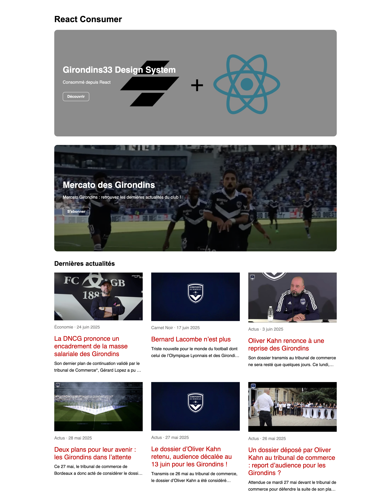

# Girondins33 React Consumer

React application demonstrating the consumption of Web Components generated by the G33 Design System.

## Live Demo

👉 [g33-react-consumer.vercel.app](https://g33-react-consumer.vercel.app/)

## Overview



## Features

- Consumption of Web Components built with Stencil
- Hero Banner integration with Storyblok
- Latest news integration through the WordPress REST API
- React + TypeScript application built with Vite
- Deployment on Vercel

## Architecture

```text
Storyblok
    ↓
React Application
    ↓
Hero Banner

WordPress REST API
    ↓
React Application
    ↓
Article Cards
```

## Technologies

- React
- TypeScript
- Vite
- Stencil Web Components
- Storyblok
- WordPress REST API
- Vercel

## Development

```bash
npm install
npm run dev
```

## Build

```bash
npm run build
```

## Related Project

🔗 [G33 Design System](https://github.com/juliencap/g33-stencil-design-system)

## Author

Julien Capd
